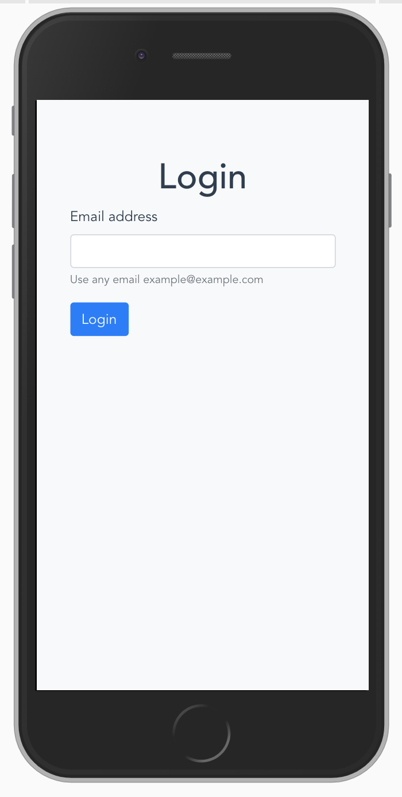
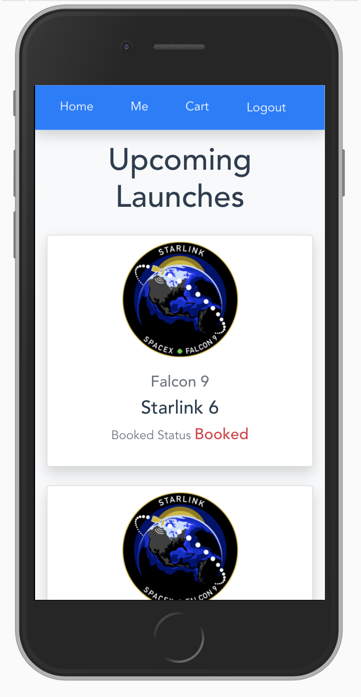
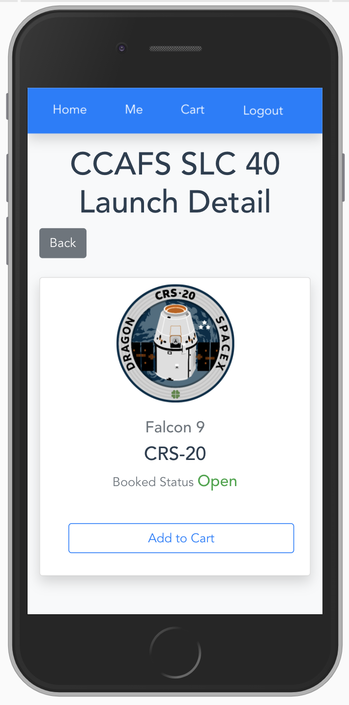
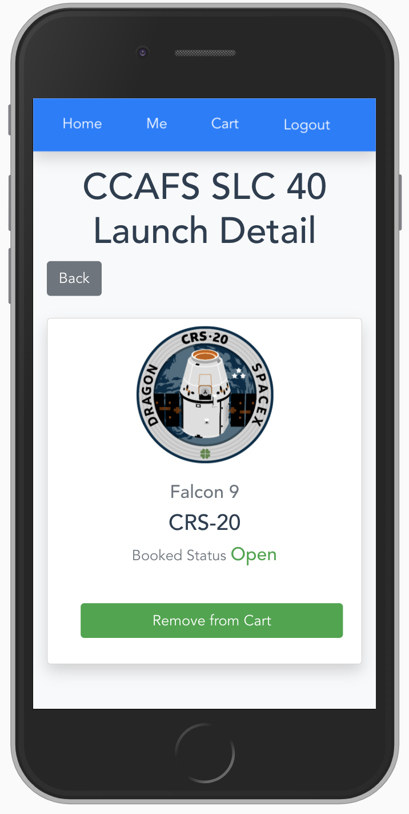
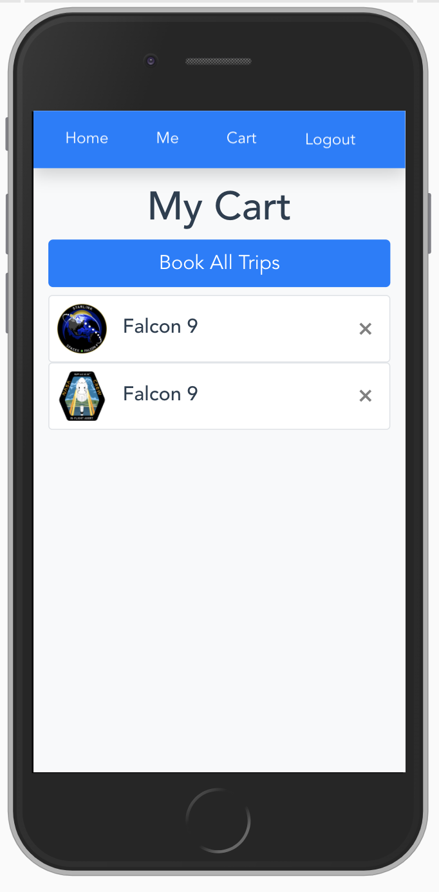
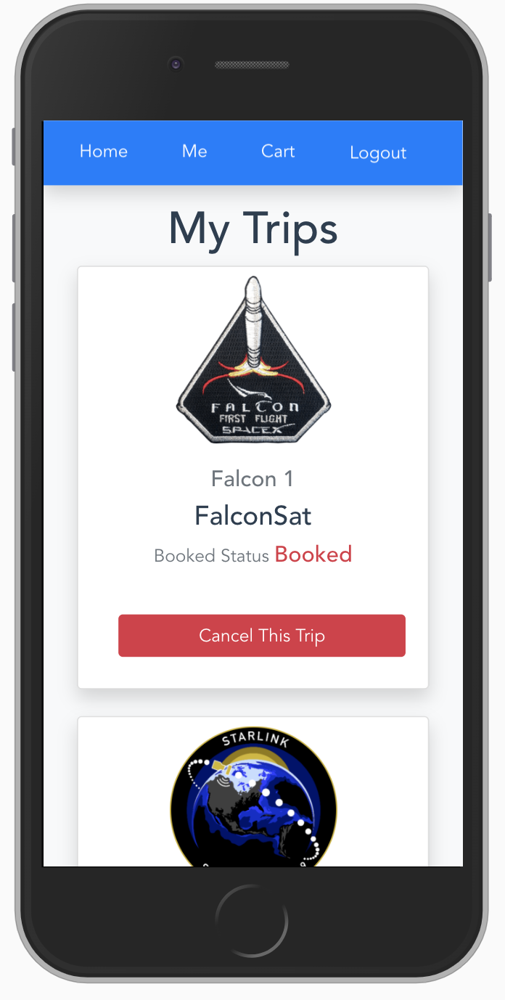

# Apollo Server and Client App

## Frontend

1. React
2. Apollo Client

## Backend

1. Apollo server

## App Functionalities

1. Fetch a list of all upcoming rocket launches
2. Fetch a specific launch by its ID
3. Log in the user
4. Book a launch for a logged-in user
5. Cancel a previously booked launch for a logged-in user

## App UI

|           Login            |             Upcoming Launches             |
| :------------------------: | :---------------------------------------: |
|  |  |

 

|            Launch Detail            |       Launch Detail Added to cart       |
| :---------------------------------: | :-------------------------------------: |
|  |  |

 

|             My Cart             |            My Trip             |
| :-----------------------------: | :----------------------------: |
|  |  |

 
